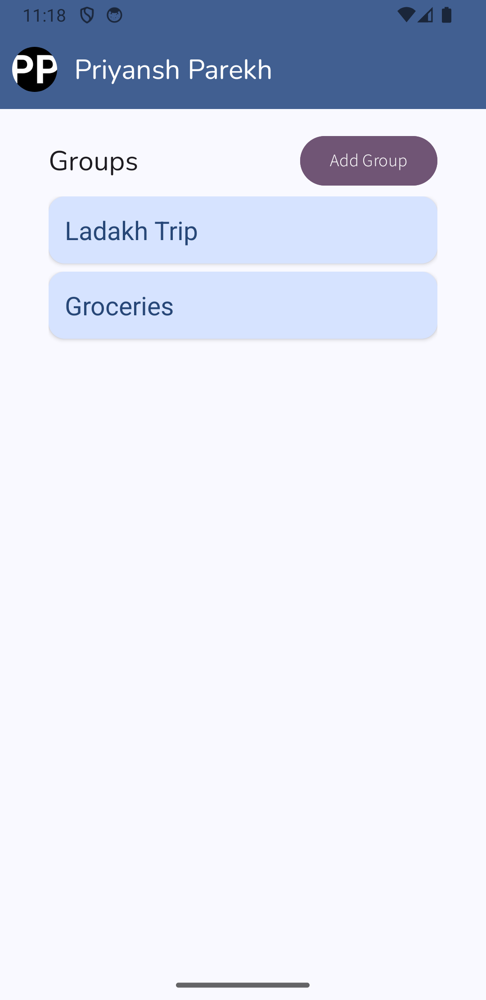
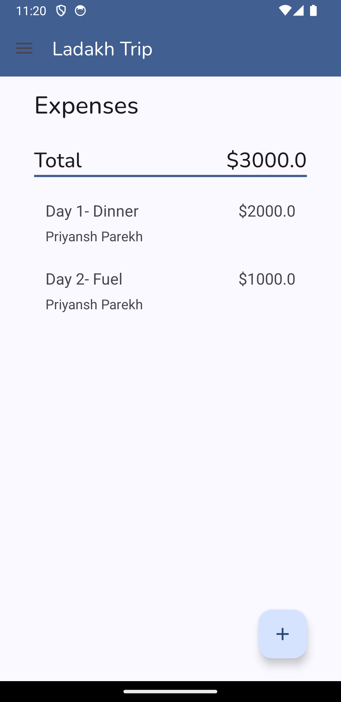
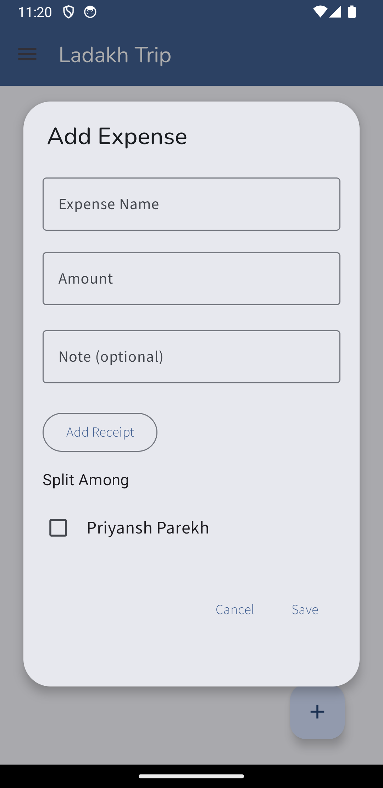
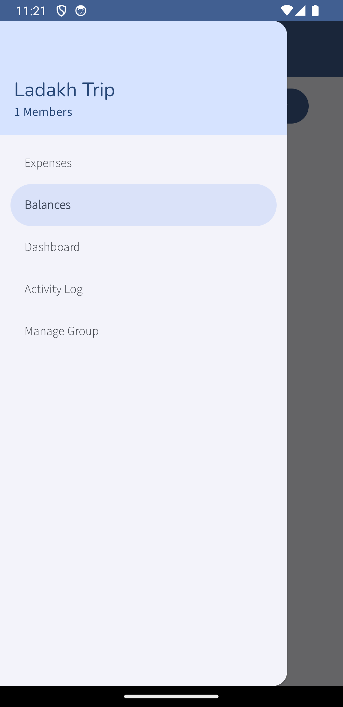
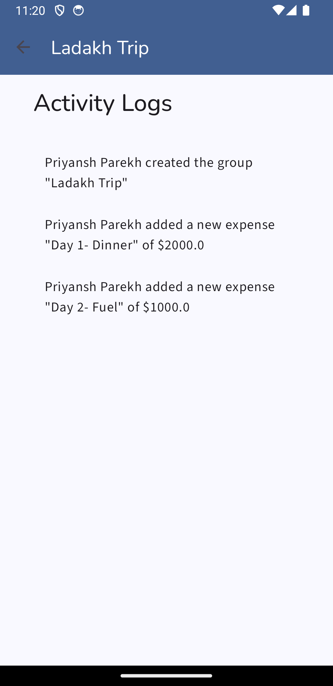
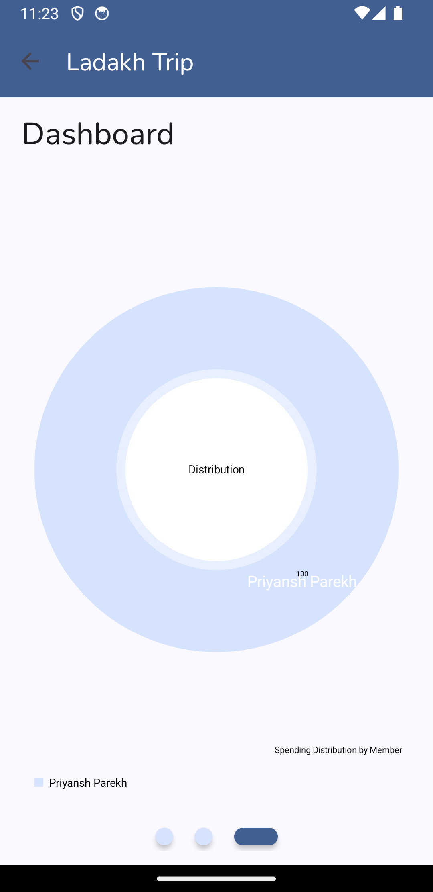

# FairShare

FairShare is a **group expense sharing app** that helps users split bills, track shared expenses, and settle payments easily. Ideal for friends, roommates, or teams sharing common costs.

## Features

- Create and manage groups
- Add members and assign expenses
- Split bills among selected members
- Upload and attach receipts
- Settle payments with pay/request flows
- Push notifications for group activity
- Visualize spending history with graphs

## Screenshots

| | | |
|---|---|---|
|  |  |  |
| Home Screen | Expense Screen | Add Expense Screen |
|  |  |  |
| Menu | Activity Logs Screen | Dashboard Screen |

## Tech Stack

This project started as a Cloud Computing class assignment built entirely on AWS, and has since been migrated to a self-hosted local stack to keep it running without ongoing cloud costs.

### Original Stack (AWS-based)

**Frontend:** Android, Kotlin, AWS Cognito SDK for auth

**Backend:** Spring Boot, Java, AWS RDS (MySQL), AWS S3, AWS SNS, AWS Cognito, AWS EC2

### Current Stack (Local Development)

**Frontend:** Android, Kotlin, direct OAuth2/OIDC login against Keycloak, Firebase Cloud Messaging

**Backend:** Spring Boot, Java, MySQL, SeaweedFS (S3-API-compatible object storage), Keycloak, Firebase Admin SDK, Docker Compose

## Architecture (Current)

The app talks to Keycloak directly for login and to the Spring Boot backend for everything else (signup, groups, expenses, receipts), with the backend backed by MySQL, SeaweedFS, and Firebase — all running locally via Docker Compose.

## Note on Original Architecture & Documentation

This project's original architecture and write-up reflect the AWS-based version built for the Cloud Computing class it was submitted for, and are kept unchanged as a record of that submission:

- [FairShare Architecture.png](./FairShare%20Architecture.png) — original AWS-based architecture diagram
- [FairShare - Project Documentation.pdf](./FairShare%20-%20Project%20Documentation.pdf) — original project documentation

The codebase itself has since moved on to the local stack described above, the diagram and PDF do not reflect the current implementation.
